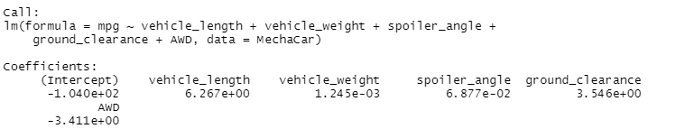
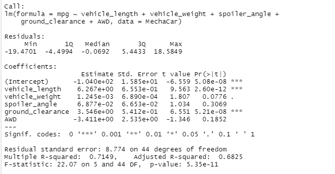
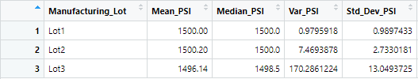
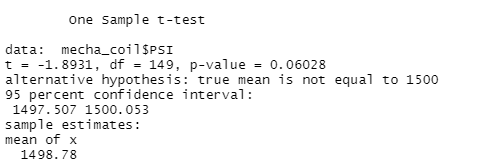
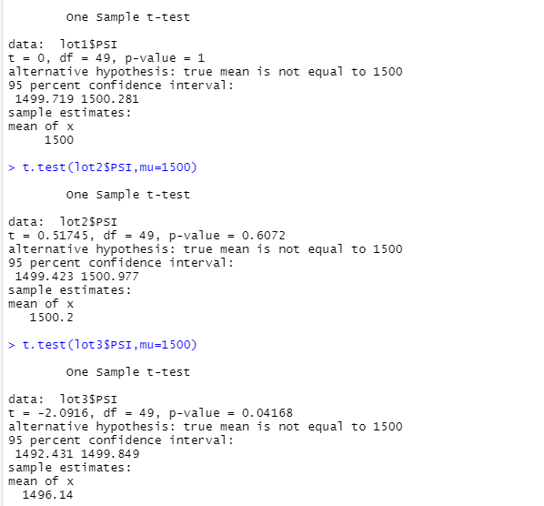

# MechaCar Statistical Analysis

## Linear Regression to Predict MPG
### Linear Regression 

### Perform Summary

### Analysis

The variables that provided a non-random amount of variance to the mpg values in the dataset were vehicle length and vehicle ground clearance. Compared to vehicle weight, spoiler angle and all-wheel drive, which have p-Values indicating a random amount of variance with the dataset. The p-Value is 5.35e-11. This is much smaller than the assumed significance level of 0.05%. This value indicates there is sufficient evidence to reject our null hypothesis, indicating, as well, that the slope of this linear model is not zero. This multiple regression model does predict mpg of MechaCar prototypes effectively. Because the r-squared value is 0.7149, meaning 71% of all mpg predictions will be determined by this model. 
## Summary Statistics on Suspension Coils

### Total Summary

### Lot Summary

### Analysis

The design specifications for the MechaCar suspension coils dictate that the variance of the suspension coils must not exceed 100 pounds per square inch. When looking at the total summary it appears that the variance of the coils is 62.29 PSI which is well within the 100 PSI variance requirement, meaning the total manufacturing lots meets the specification. However, when we look specifically at the lots, we see that lot 1 and 2 are within the 100 PSI variance requirement, however lot 3 is over at 170.3 PSI.

## T-Tests on Suspension Coils

### One Sample T Test

### Three Sample T Tests

### Analysis

Conducted a t-test on the suspension coil data to determine if there is a statistical difference between the mean of this provided dataset and a hypothesized potential population dataset. We used 1,500 as the population. The true mean of the sample is 1498.78. The p-Value is 0.06, this is higher than the significance level of 0.05. This means there is not sufficient evidence to support rejecting the null hypothesis. When looking at the individual lots, lot 1 and 2 have higher p-Values at 1 and 0.61, however lot 3 had a p-Value of 0.04, which is lower than the significance level of 0.05. The data indicates that an error might have occurred in lot 3 due to the differing levels of data from lots 1 and 2.

## Study Design: MechaCar vs Competition 

Knowing that safety has been top of mind during the pandemic, I believe customers are also looking for the same level of safety when purchasing a car. A statistical study we could run to quantify how the MechaCar performs against the competition is to look at the safety rating.

### Metric to test

Evaluate MechaCar’s and other competitor vehicles’ safety ratings. 

### Null and Alternate Hypothesis 

- H0: MechaCar prototypes' average safety rating is similar to competitor's vehicles in the same vehicle class 
- Ha: MechaCar prototypes' average safety rating is statistically above or below that of competitor vehicles.

### Statistical Test Used

Use two-sample t-tests.
### What data is needed

Need to gather data on safety ratings of the MechaCar prototypes, as well as, competitor vehicles. 

